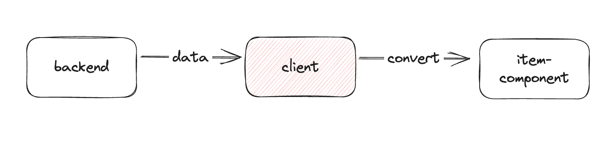

 
현재 타입스크립트는 프론트 생태계에서 떼어낼 수 없는 존재가 되었다. 
타입스크립트를 사용함으로써 자바스크립트에서 생길 수 있는 런타임 에러를 사전에 방지할 수 있기 때문이다. <br/>
이는 프론트엔드 개발자들이 조금 더 안전하게 코드를 짜는데 도움을 준다. <br/>
그러나 타입스크립트를 현명하게 사용하지 못한다면, 나중에 코드를 확장하는데 어려움을 겪을 뿐더러,
타입스크립트를 사용하는 의미가 없어지게 된다. 

예를 들면, 처음에는 `Person` 만 가능헀던 타입이 나중에는 `Person | string` 으로 확장되면서 
결국 string 모든 타입은 전부 사용이 가능하게되는 불상사가 생기게 된다. 

오늘은 타입스크립트 단언식에 대해 설명하고, 단언식을 사용한 코드를 어떻게 변경해야 좋은지에 대해 
이야기해보고자 한다.

---

### 단언문이란?
타입스크립트에서 타입을 부여하는 방법에는 2가지가 있다. <br/>
타입 선언과 타입 단언이 있는데, 타입 단언보다 타입 선언을 사용하는 것이 좋다.

```typescript
interface Fruits {
  name: string;
}

// 1. 타입 선언
const a: Fruits = { name: 'apple' };
// 2. 타입 단언
const b = { name: 'orange' } as Fruits; 
```
<br/>
그 이유는 타입 단언을 사용하는 경우에는,타입스크립트가 추론한 타입과 단언된 타입이 다르더라도, 단언된 타입으로 인지하게 된다. <br/>
그렇기 때문에 아래의 예시를 보면, 
변수 `c`에서는 `name` 프로퍼티가 없다는 에러가 노출되는 반면에 <br/> 
변수 `d` 에서는 빈객체임에도 불구하고 단언된 `Fruits`를 타입으로 인지하여 에러가 노출되지 않는다. 

```typescript
// Property 'name' is missing in type '{}' but required in type 'Fruits' 
const c: Fruits = {}; 
// type checker not working 
const d = {} as Fruits;
```
이런 결과가 생기는 이유는, 타입 선언은 타입 체커가 동작하는 반면에 타입 단언은 타입 체커에게 오류를 무시하라고 하는 것과 같기 때문이다.
타입 단언의 방식은, 추후에 런타임에러로 이어져 타입스크립트를 사용하는 이유가 없어지게 된다.
<br/>

### 단언문은 언제 사용해야할까?
그렇다면, 타입스크립트에 단언식은 왜 존재하는 것일까?<br/> 
타입스크립트가 아무리 타입을 잘 추론한다고 하더라도, DOM의 정보라던가, 외부 라이브러리의 타입 등에 대해서는 개발자가 더 잘 알고 있을 수 있다. <br/>
그런 상황에서는 타입 단언문을 사용하는 것이 더 옳은 방법이라고 할 수 있다. 

```typescript
const button = document.querySelector('#button')!; // <- !는 null 이 아님을 단언한다
button.addEventListener('click', (e: Event) => { 
    const target = e.target as HTMLElement; // <- 타입 단언문 사용
    console.log(target.dataset); 
});
```

<br/>

### 단언문이 사용된 코드 떼어내기
개발을 하다보면, 여기저기에 단언문이 사용되고 있는 것을 볼 수 있다. (단언문을 사용했다고 해서 잘못된 건 아니다.. 그 상황의 최선일 수도 있었음을 기억하자..) <br/> 
단언문은 지금 당장 에러를 일으키지 않아도 기능이 추가된다던지, 코드를 리팩터링한다던지 등의 그 부분을 수정할 이유가 생긴다면 사이드 이펙트가 일어날 수 있는 부분이다. <br/>

내가 회사 코드에서 찾은 단언문 코드를 수정해보고자 한다. 
북마크 리스트 API를 호출할 때 들어오는 데이터가 각 `bookmark_type`에 따라 인터페이스가 다를 경우, 
이 부분을 단언문을 사용하지 않고, 어떻게 수정할 수 있을지에 대한 방법이다. 



```typescript
// basic code
const BOOKMARK_CATEGORIES = {
    CHANNEL: 'channel',
    PROJECT: 'project',
    DIRECT_MESSAGE: 'dm',
} as const;

type BookmarkCategoriesType = typeof BOOKMARK_CATEGORIES[keyof typeof BOOKMARK_CATEGORIES];

interface BookmarkChannelValuesType {
    ch_id: string;
    ch_name: string;
    msg_id: string;
    ws_id: string;
    ws_name: string;
    user_id: string;
}

interface BookmarkProjectValuesType {
    log_id: string;
    prj_id: string;
    prj_name: string;
    ws_id: string;
    ws_name: string;
    assign_user_ids: string[];
}

interface BookmarkDirectMessageValuesType {
    contents_id: string;
    members: string[];
    room_id: string;
    room_name: string;
    room_type: string;
    user_id: string;
} 
```
`bookmark_type`의 종류가 `channel`, `project`, `dm` 세 가지가 있다고 가정해보자. <br/>
이 3가지 종류에 따라 전부 다른 인터페이스를 가진 데이터를 호출한다.

`getName` 이라는 메서드를 통해 전부 같은 인터페이스로 변경하여 자식 컴포넌트는 동일한 인터페이스를 받는 코드가 있다. 
```typescript
interface BookmarkApiType {
    bookmark_id: string;
    bookmark_type: BookmarkCategoriesType;
    values: BookmarkChannelValuesType | BookmarkProjectValuesType | BookmarkDirectMessageValuesType;
}

// dummy data from backend
const apiResponse: BookmarkApiType = {
    bookmark_id: '1',
    bookmark_type: BOOKMARK_CATEGORIES.CHANNEL,
    values: {
        ch_id: 'chId',
        ch_name: 'channelName',
        msg_id: 'msgId',
        ws_id: 'workspaceId',
        ws_name: 'workspaceName',
        user_id: 'userId',
    },
};

const getName = (item: BookmarkApiType) => {
    switch(item.bookmark_type) {
        case BOOKMARK_CATEGORIES.CHANNEL: 
            return item.values.ch_name;  
            // Property 'ch_name' does not exist on type 'BookmarkChannelType | BookmarkProjectType | BookmarkDirectMessageType'.
        case BOOKMARK_CATEGORIES.PROJECT:
            return item.values.prj_name;
            // Property 'prj_name' does not exist on type 'BookmarkChannelType | BookmarkProjectType | BookmarkDirectMessageType'.
        case BOOKMARK_CATEGORIES.DIRECT_MESSAGE:
            return item.values.room_name;
            // Property 'room_name' does not exist on type 'BookmarkChannelType | BookmarkProjectType | BookmarkDirectMessageType'.
    }
}

getName(apiResponse);
```

<br/>
각각의 프로퍼티들이 우리가 선언한 타입과 맞지 않아 컴파일에러를 일으키게 된다. <br/>
이런 에러를 직면하게 되면 우리는 변수로 따로 선언하여 타입 선언문을 이용해보지만, 이 방법으로는 해결할 수 없다. <br/> 
그 다음에 생각하는 방법이 "타입 단언문"이다. 그래서 우리는 아래와 같은 코드를 만들어내곤 한다.

```typescript
const getName = (item: BookmarkApiType) => {
    switch(item.bookmark_type) {
        case BOOKMARK_CATEGORIES.CHANNEL: 
            return (item.values as BookmarkChannelValuesType).ch_name;
        case BOOKMARK_CATEGORIES.PROJECT:
            return (item.values as BookmarkProjectValuesType).prj_name;
        case BOOKMARK_CATEGORIES.DIRECT_MESSAGE:
            return (item.values as BookmarkDirectMessageValuesType).room_name;
    }
}
```
그렇다면 우리는 타입 단언문을 어떻게 떼어낼 수 있을까? 
지금 타입 설정에는 bookmark_type와 values 프로퍼티의 링크가 되어있지 않다. 
이 부분을 합쳐서 다시 작성하면 우리는 이 이슈를 겪지 않게 될 것이다. 

```typescript
interface BookmarkType {
  bookmark_id: string;
  //....
}

interface BookmarkChannelApiType extends BookmarkType {
    bookmark_type: typeof BOOKMARK_CATEGORIES.CHANNEL;
    values: BookmarkChannelValuesType;
}

interface BookmarkProjectApiType extends BookmarkType {
    bookmark_type: typeof BOOKMARK_CATEGORIES.PROJECT;
    values: BookmarkProjectValuesType;
}

interface BookmarkDmApiType extends BookmarkType {
    bookmark_type: typeof BOOKMARK_CATEGORIES.DIRECT_MESSAGE;
    values: BookmarkDirectMessageValuesType;
}

type BookmarkApiType = BookmarkChannelApiType | BookmarkProjectApiType | BookmarkDmApiType;

const getName = (item: BookmarkApiType) => {
    switch(item.bookmark_type) {
        case BOOKMARK_CATEGORIES.CHANNEL: 
            return item.values.ch_name;
        case BOOKMARK_CATEGORIES.PROJECT:
            return item.values.prj_name;
        case BOOKMARK_CATEGORIES.DIRECT_MESSAGE:
            return item.values.room_name;
    }
}
```
이렇게 타입 리터럴을 사용하여 타입 선언을 해준다면, <br/>
나중에 기능이 추가가 되어 `bookmark_type`이 추가가 된다면, 그에 맞춰 타입을 하나 생성해주면 될 뿐이다. 

<br/>
### Reference
[이펙티브 타입스크립트](https://www.yes24.com/Product/Goods/102124327)